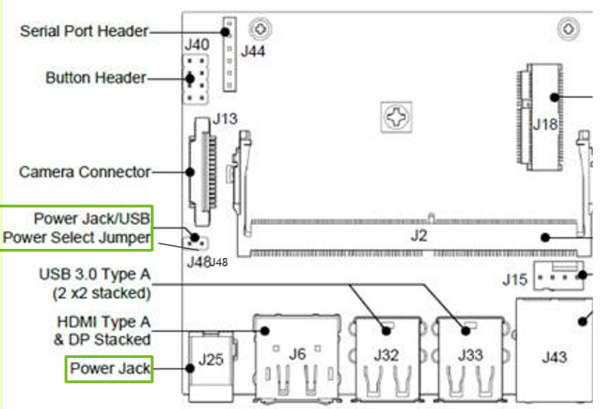
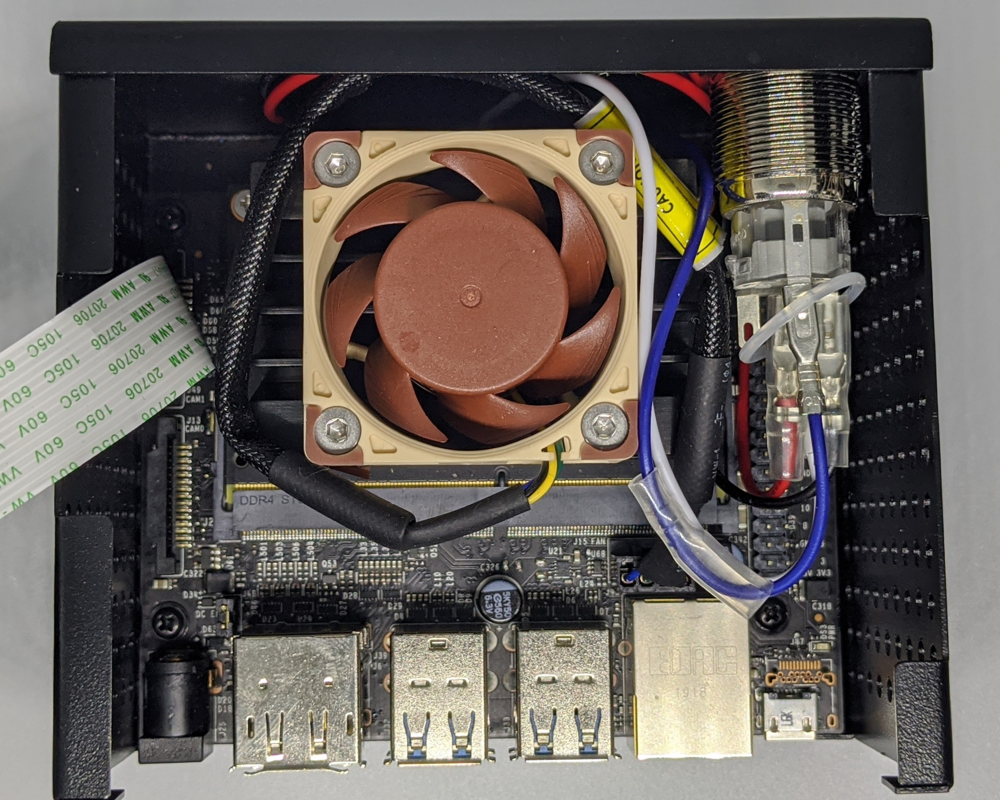

# Computer Vision Starter Pack

> Cheap Nvidia Computer Vision Camera

## Overview

I have recently been toying around with computer vision more. I was looking for a [low cost Nvidia GPU](https://developer.nvidia.com/embedded/jetson-nano-developer-kit) and [camera sensor](https://www.electronicsdatasheets.com/download/5721ed8ce34e24fd697a913a.pdf?format=pdf) to bootstrap some projects. Sure you can started programming inside a [Google Colabnotebook](https://colab.research.google.com/), but I am more interested in embedded systems and [applied machine learning](https://github.com/onnx/models). 

The goal is to start programming real-time camera pipelines, converting state of the art models into [TensorRT](https://docs.nvidia.com/deeplearning/tensorrt/api/python_api/index.html), and using Nvidia optimized [computer vision libraries](https://developer.nvidia.com/embedded/visionworks-1-5-3) for things like [optical flow](https://developer.nvidia.com/opticalflow-sdk) and [slam](https://arxiv.org/pdf/1911.11763.pdf). My go to strategy in hardware is always to start small. I want to fully utilize the computing resources before leveling up.


I quick look at the [prices](https://www.nvidia.com/en-us/autonomous-machines/embedded-systems/) and you can see that you actually pay more per cuda core as you up the line. The Jetson Nano and TX2 both at around $1 per core. A closer look at the specs,  shows the [Jetson Xavier](https://developer.nvidia.com/embedded/jetson-agx-xavier-developer-kit) series boards also include tensor cores for doing 8 bit operations and a dedicated vision processing module which may justify the higher price. 

So, I decided to build out on a standard Jetson Nano Development board. Even though the board is listed at $128 for 1k volume, I was able to find one amazon for a little over a $100. My go to strategy in hardware is always to start small. I want to fully utilize the computing resources before leveling up. This guide will go over how to put it all together.


## Materials

0. [Nvidia Jetson Nano Developer Kit](https://developer.nvidia.com/embedded/jetson-nano-developer-kit)

1. [Sony IMX219 Wide Angle CSI Camera Sensor](https://www.sainsmart.com/products/sainsmart-imx219-camera-module-for-nvidia-jetson-nano-board-8mp-sensor-160-degree-fov)

2. [Samsung (MB-ME128GA/AM) 128GB 100MB/s (U3) MicroSDXC EVO Select Memory Card](https://www.samsung.com/us/support/computing/memory-storage/memory-cards)

3. [Adafruit 5V 10A Switching Power Supply](https://www.adafruit.com/product/1466)

4. [Noctua NF-A4x20 5V PWM, Premium Quiet Fan, 4-Pin, 5V Version](https://noctua.at/en/nf-a4x20-5v-pwm)

5. [Geekworm NVIDIA Jetson Nano Metal Case/Enclosure with Power & Reset Control Switch](https://geekworm.com/products/geekworm-nvidia-jetson-nano-metal-case-with-power-reset-control-switch)

## Procedure

This is a pretty standard build for Nvidia newcomers like myself. I followed resources available from the developer nvidia [documentation/forums](https://forums.developer.nvidia.com/) and [Jetson Hacks](https://www.youtube.com/channel/UCQs0lwV6E4p7LQaGJ6fgy5Q).

### 0. Flash and bootup Jetson Nano

Before we get started, make sure you have ordered and received your Jetson Nano Developer Kit, and Samsung Micro SD card. Hopefully you have also have a spare monitor with an HDMI port laying around. 

The first step is to flash your SD card with Nvidia's [Jetpack](https://developer.nvidia.com/embedded/jetpack) OS, which is essentially Ubuntu with some extra software and Nvida SDKs that come pre-installed. Plug in the MicroSD card into your day to day computer for the initial flashing.

Follow the [instructions](https://developer.nvidia.com/embedded/learn/get-started-jetson-nano-devkit#write) from the Jetson Nano Get Started guide to write the image to your SD card. The guide includes references for mac, linux, and windows. Plugin the flashed SD card into the back of the device, and provide power through the Micro USB port. 


### 1. Internet Connection and SSH

The developer board comes with an ethernet port. Simply hook it up to your router. Keep in mind you may need to relocate your router next to your nano device or get a really long ethernet cable.

Run this shell script on your nano device to get the LAN IP address. Then we can connect over ssh to the device. `ssh USERNAME@LANIP`

```
NETCONF=$(ifconfig)
INETS=$(echo "${NETCONF}" | grep "inet ")
IPADDRS=$(echo "${INETS}" | grep -oE "\b([0-9]{1,3}\.){3}[0-9]{1,3}\b")
LANIP=$(echo "${IPADDRS}" | grep 192 | grep -v 255)
echo "${LANIP}"
```

### 2. Attach/Configure Sony IMX219 Camera Sensor

Pretty simple to install camera into one of the two CSI ports on the jetson nano, make sure contact stripts are facing towards the device and secure the clip for stable contact.

Now you can check if the camera is working by capturing a live video stream and displaying. To view display you will need a monitor connected over HDMI.

```
gst-launch-1.0 nvarguscamerasrc sensor_id=0 ! nvoverlaysink
```

Gstreamer is a great tool for handling video feeds. Highly recommend the [intro tutorials](https://gstreamer.freedesktop.org/documentation/tutorials/basic/index.html?gi-language=c) which uses the C API. Your Jetpack Gstreamer comes with hardware acceleration out of the box.

[nvarguscamerasrc](Hiaxu2bM2gk_VWiYivfDAs6PoSAV9LNuVKM_T1cAbmyGW6mYM8E_0c) is an nvidia tool for automating camera bring up and configurations. It uses the [libargus](https://docs.nvidia.com/jetson/l4t-multimedia/group__LibargusAPI.html) api under the hood.

You may notice some pink vignnetting on the outside edges of the frame. We can easily download some ISP overrides to solve this issue.

```
wget https://www.waveshare.com/w/upload/e/eb/Camera_overrides.tar.gz
tar zxvf Camera_overrides.tar.gz 
mv camera_overrides.isp /var/nvidia/nvcam/settings/
sudo chmod 664 /var/nvidia/nvcam/settings/camera_overrides.isp
sudo chown root:root /var/nvidia/nvcam/settings/camera_overrides.isp
```

### 3. Fan and Power Supply Setup

At this point you are up and running with your nano device. If you try running some of the [DeepStream](https://docs.nvidia.com/metropolis/deepstream/4.0/dev-guide/index.html) example projects which use neural nets on video streams you will start to see your nano heat up. You can run `tegrastats` to diagnose your nano. You

```
$ tegrastats

RAM 3029/3956MB (lfb 46x4MB) SWAP 429/1978MB (cached 15MB) 
CPU [24%@921,23%@921,19%@921,15%@921] 
EMC_FREQ 0% GR3D_FREQ 51% PLL@4aa 
CPU@47a PMIC@100C GPU@46.5C AO@53C 
thermal@46.75C POM_5V_IN 5716/5591 
POM_5V_GPU 2204/2170 POM_5V_CPU 708/845
```

Now it is time to install a proper power supply and fan. The power supply provides `4A * 5V = 20W` of power. In order to use barrell jack instead of microusb, use the jumper pin provided in the devleopment to cover `J48 Power Jack/USB Power Select Jumper`. Plug power supply into barrell and the nano should boot up.



To attatch the fan, first use an M3 threading tool to exapnd the holes ontop of the heatsink. I used an `Aligle 5pcs Brand New Daily Household Steel Silver Adjustable T Type One-Hand Ratchet Wrench with M3-M8 Taps Threading Tool (M3-M8)` to get the job done. Next use M3 25mm hex screws to bolt the fan to the heatsink.

### 4. Enclosure and Camera Mount

Attach power an reset button and connect the CSI camera before screwing the board into the base of the box. 



I attached the camera mount panel to the opposite of the CSI ports to allow the ribbon cable to lay flight when packed.

## Conclusion

Ok, we now have a fully functioning and powerful computer vision camera to work with. In the next experiment, we will build a realtime camera that runs object detection on the gpu.
